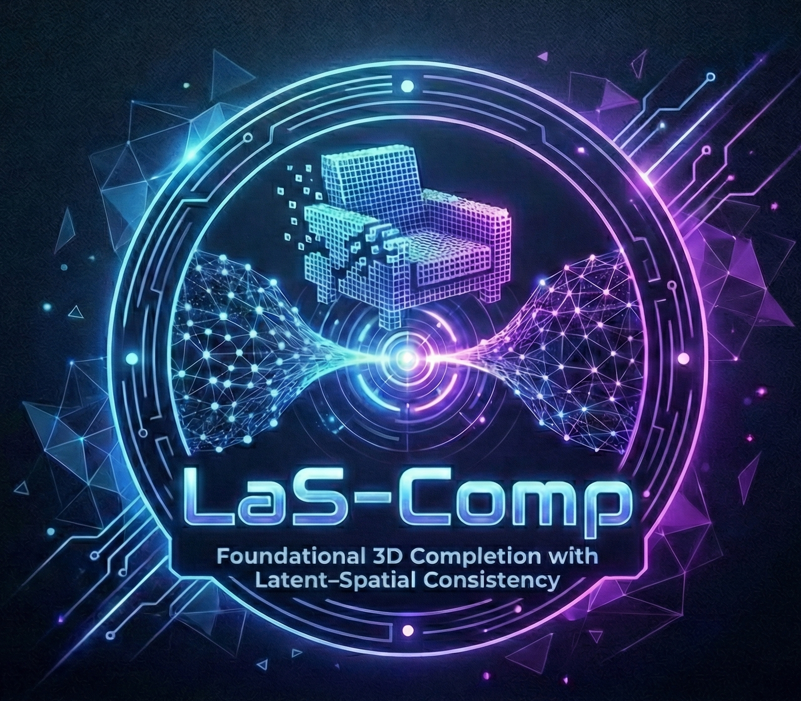

<h1 align="center" style="margin-top:0;">
  LaS-Comp [CVPR 2026]
</h1>

<p align="center">
  <a href="https://arxiv.org/abs/2602.18735">
    📄 Paper (arXiv)
  </a>
</p>

<p align="center" style="margin-bottom:0;">
  
</p>

<p align="center">
  This is the official repository of
  "<b>LaS-Comp: Zero-shot 3D Completion with Latent–Spatial Consistency</b>".
  <br>
  Our code and data will come soon!
</p>

## Citation
If you find our work helpful, please consider citing:
```
@misc{lascomp,
      title={LaS-Comp: Zero-shot 3D Completion with Latent-Spatial Consistency}, 
      author={Weilong Yan and Haipeng Li and Hao Xu and Nianjin Ye and Yihao Ai and Shuaicheng Liu and Jingyu Hu},
      year={2026},
      eprint={2602.18735},
      archivePrefix={arXiv},
      url={https://arxiv.org/abs/2602.18735}, 
}
```
